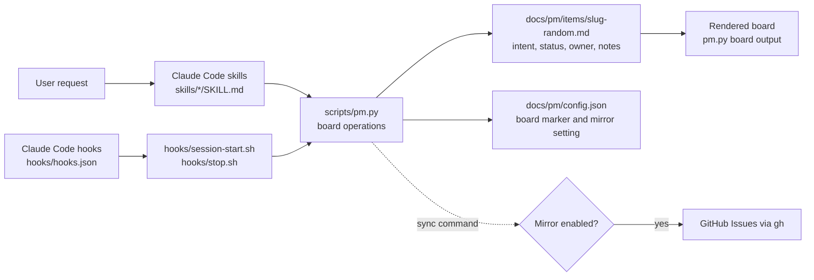

# Plugin architecture

The plugin uses Claude Code skills for conversational workflow, a Python standard-library CLI for shared board operations, and project-owned Markdown for state. It starts no reviewer agents and has no scheduled runner.

## Components and dependencies



Sources: [plugin manifest](../.claude-plugin/plugin.json), [skills](../skills/), [CLI](../scripts/pm.py), [hooks](../hooks/).

## Work and data flow

```mermaid
sequenceDiagram
  actor Person
  participant Skill as Claude Code skill
  participant CLI as scripts/pm.py
  participant Lock as local file lock
  participant Remote as remote default branch
  participant Item as docs/pm/items/slug-random.md
  Person->>Skill: request or start work
  Skill->>CLI: init / add / set / hold / resume / claim
  CLI->>Lock: acquire exclusive local file lock
  CLI->>Remote: fetch the latest default branch
  CLI->>Item: check and change the item in a temporary checkout
  CLI->>Remote: push the item commit without force
  Remote-->>CLI: accept one update or reject a race
  CLI->>Remote: fetch and re-check after rejection
  CLI->>Item: fast-forward the local default branch when checked out
  Skill->>CLI: finish on the work branch
  CLI->>Item: commit only the item file; the PR merge publishes it
  CLI-->>Skill: item path and rendered board
  Skill-->>Person: work result and next ready item
```

`next` selects only queued items with no hold and with all dependencies done. Claim changes a queued item to In flight while holding the same lock used by other CLI writes. Without a remote, writes change the local item files and only `finish` commits. Finishing records a UTC completion time; the rendered board shows the newest ten Done items and counts older ones. Because each change touches only its own item file, parallel work branches merge without board conflicts.

## Inputs, outputs, and external dependencies

| Component | Input | Output | Depends on |
| --- | --- | --- | --- |
| `/pm:init` | Current project and existing instructions | `docs/pm/`, concise `AGENTS.md` when absent | Claude Code file tools, Python CLI |
| `/pm:plan` | Requester's exact words, optional dependencies or decision question | Queued item detail published to the shared default branch | `scripts/pm.py add`, `set`, `hold` |
| `/pm:work` | Queued item and person's name | Claim before changes, code/doc updates, current item notes, Done or In flight status | CLI lock and project checks |
| `/pm:status` | Project board | In flight owners, Queued, Waiting, Done, ready items | `scripts/pm.py board` |
| `/pm:map` | Repository source, metadata, docs, tests | `docs/pm/CODEBASE.md` with component and flow diagrams | Claude Code read/write tools |
| `SessionStart` hook | Current project directory | Rendered board in session context | `python3`; otherwise points to `docs/pm/items/` |
| `Stop` hook | Git status and item files | Reminder when code changed without an item update | `git`, bash |
| Optional `sync` | Item Markdown and GitHub repo | GitHub Issues created/updated; issue ID saved in item | `gh` CLI and opt-in mirror setting |

The model is selected by the Claude Code session. The plugin does not name a model or launch subagents. Its persistent data is plain Markdown; the CLI uses only Python's standard library. New item IDs combine a short title slug and random suffix, with a local duplicate check. The CLI uses OS file locking (`fcntl` on Unix-like systems and `msvcrt` on Windows); its remote claim path fetches the default branch and retries ownership checks after a rejected push. See the [README](../README.md) for the user-facing collaboration and GitHub mirror contract.
