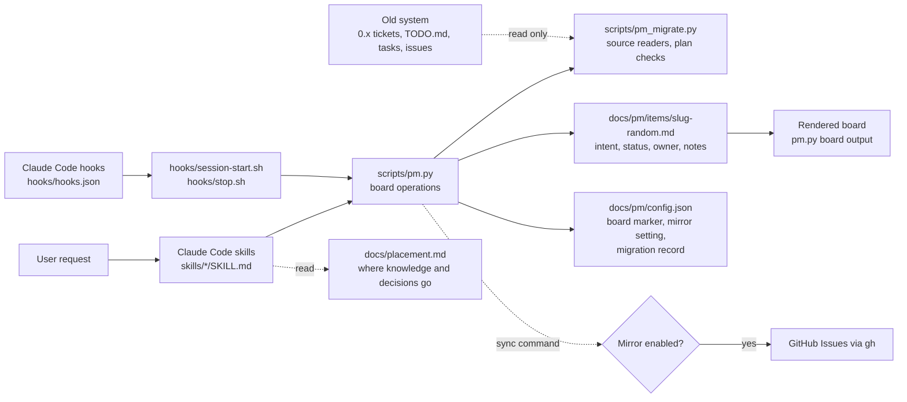
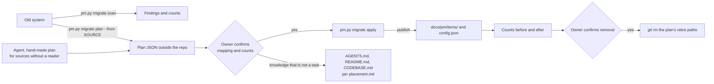

# Plugin architecture

The plugin uses Claude Code skills for conversational workflow, a Python standard-library CLI for shared board operations, and project-owned Markdown for state. It starts no reviewer agents and has no scheduled runner.

## Components and dependencies



Sources: [plugin manifest](../.claude-plugin/plugin.json), [skills](../skills/), [CLI](../scripts/pm.py), [migration readers](../scripts/pm_migrate.py), [hooks](../hooks/), [placement guide](placement.md), [setup and migration manual](manual.md).

## Work and data flow

```mermaid
sequenceDiagram
  actor Person
  participant Skill as Claude Code skill
  participant CLI as scripts/pm.py
  participant Lock as local file lock
  participant Remote as remote default branch
  participant Item as docs/pm/items/slug-random.md
  Person->>Skill: request or start work
  Skill->>CLI: init / add / set / hold / resume / claim
  CLI->>Lock: acquire exclusive local file lock
  CLI->>Remote: fetch the latest default branch
  CLI->>Item: check and change the item in a temporary checkout
  CLI->>Remote: push the item commit without force
  Remote-->>CLI: accept one update or reject a race
  CLI->>Remote: fetch and re-check after rejection
  CLI->>Item: fast-forward the local default branch when checked out
  Skill->>CLI: finish on the work branch
  CLI->>Item: commit only the item file; the PR merge publishes it
  CLI-->>Skill: item path and rendered board
  Skill-->>Person: work result and next ready item
```

`init`, `plan`, `work`, `map`, and `help` read the single [placement guide](placement.md) instead of restating it. For decisions, `hold` stores the question on the item and takes it to Waiting; `resume --answer` saves the decider's exact words at the top of `## Current notes` in the same commit as the resume, which matters because a notes edit made by hand on the default branch would block the CLI's fast-forward. Lasting decisions go to `AGENTS.md` or `CODEBASE.md` through the normal change.

`next` selects only queued items with no hold and with all dependencies done. Claim changes a queued item to In flight while holding the same lock used by other CLI writes. Hold and resume never change the owner, so a held claim returns to In flight for the same person and no one else can claim it. Without a remote, writes change the local item files and only `finish` commits. Finishing records a UTC completion time; the rendered board shows the newest ten Done items and counts older ones. Because each change touches only its own item file, parallel work branches merge without board conflicts.

## Migration flow

`/pm:migrate` (reached from `/pm:init` when its scan finds an existing system) moves another task system onto the board in three separate commands, so the owner confirms between reading and writing.



`scan` and `plan` only read. A reader in `scripts/pm_migrate.py` (registered in `SOURCES`: `pm-0x` and `checklist`) returns a plan: items with the requester's words verbatim, a status of queued or in-flight, an optional hold, dependencies as old keys, and an optional issue number, plus the entries left in git history, knowledge to route, warnings, and the paths to retire. Sources without a reader get a hand-made plan of the same shape. `validate_plan` rejects an unknown status (finished work belongs in history), an in-flight item without an owner, a missing intent, a multi-line title, a non-string optional field, a duplicate key, an unknown dependency, a cycle, and a non-numeric issue before anything is written. `apply` ends each item id with a hash of the plan's `source` and the item's `key`, so a repeat run skips items whose id ends with that hash even if the title changed, writes through the same `publish` transaction as `add`, records every key the plan accounted for (items and history) under `migrated_from.<source>` in `docs/pm/config.json`, merged into the existing settings, and prints the board's counts afterwards. No command deletes the old system; removal is a separate step the agent takes with `git rm` after the owner's yes. The `SessionStart` hook prints a one-line pointer to `/pm:init` (or `/pm:migrate` when `docs/pm/config.json` exists) while any `docs/pm/tickets/T*.md` ticket id is missing from `migrated_from.pm-0x`.

## Inputs, outputs, and external dependencies

| Component | Input | Output | Depends on |
| --- | --- | --- | --- |
| `/pm:init` | Current project and existing instructions | `docs/pm/`, concise `AGENTS.md` (with a pointer to the placement guide) when absent; hands off to `/pm:migrate` when `migrate scan` finds an existing system | Claude Code file tools, Python CLI |
| `/pm:migrate` | The old system, its plan edited by the owner, the owner's yes | Items written from the plan, counts before and after, knowledge routed per the placement guide, old files removed only on confirmation | `scripts/pm.py migrate`, `scripts/pm_migrate.py`, `gh` for GitHub Issues |
| `/pm:plan` | Requester's exact words, optional dependencies or decision question or answer | Queued item detail published to the shared default branch | `scripts/pm.py add`, `set`, `hold`, `resume` |
| `/pm:work` | Queued item and person's name | Claim before changes, code/doc updates, current item notes, Done or In flight status | CLI lock and project checks |
| `/pm:status` | Project board | In flight owners, Queued, Waiting, Done, ready items | `scripts/pm.py board` |
| `/pm:map` | Repository source, metadata, docs, tests | `docs/pm/CODEBASE.md` with component and flow diagrams | Claude Code read/write tools |
| `SessionStart` hook | Current project directory | Rendered board plus a note to claim items with `/pm:work` and add work with `/pm:plan`, in session context; a pointer to `/pm:init` for an unmigrated 0.x board | `python3`; otherwise points to `docs/pm/items/` |
| `Stop` hook | Git status and item files | Reminder when code changed without an item update | `git`, bash |
| Optional `sync` | Item Markdown and GitHub repo | GitHub Issues created/updated; new issue numbers published in item files | `gh` CLI and opt-in mirror setting |

The model is selected by the Claude Code session. The plugin does not name a model or launch subagents. Its persistent data is plain Markdown; the CLI uses only Python's standard library. New item IDs combine a short title slug and random suffix, with a local duplicate check. The CLI uses OS file locking (`fcntl` on Unix-like systems and `msvcrt` on Windows); its remote claim path fetches the default branch and retries ownership checks after a rejected push. See the [README](../README.md) for the user-facing collaboration and GitHub mirror contract.
